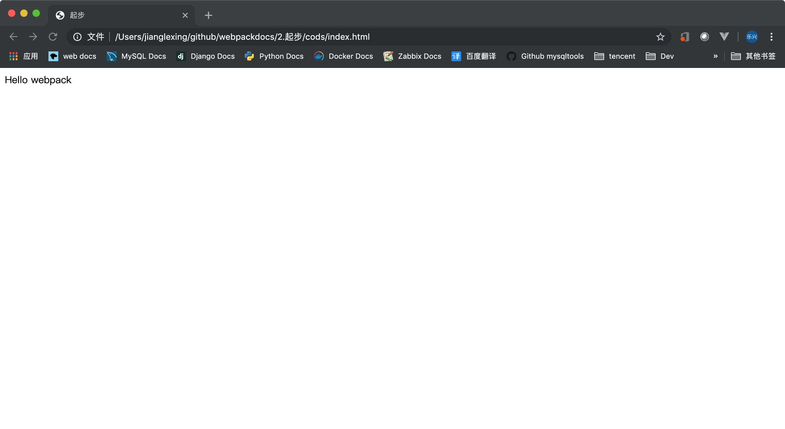
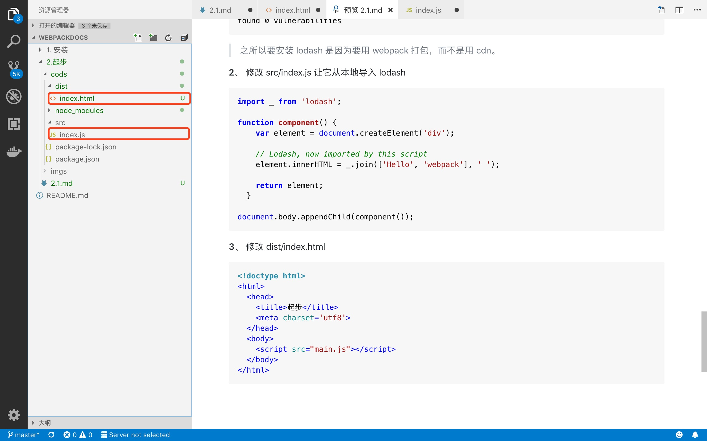
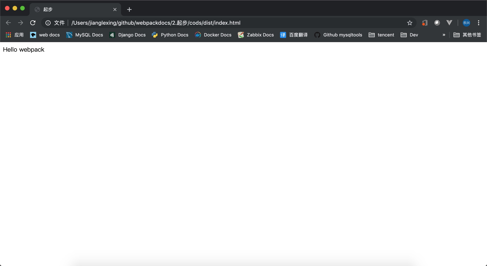

## 目录
- [起步](#起步)
- [基本安装](#基本安装)
- [增加html和js文件](#增加html和js文件)
- [创建一个bundle文件](#创建一个bundle文件)
- [模块](#模块)
- [使用配置文件](#使用配置文件)


---


## 起步
   **webpack 用于编译 JavaScript 模块**

   ---

## 基本安装
   **1、** 初始化包
   ```bash
   npm init -y
   Wrote to /Users/jianglexing/github/webpackdocs/2.起步/cods/package.json:
   
   {
     "name": "cods",
     "version": "1.0.0",
     "description": "",
     "main": "index.js",
     "scripts": {
       "test": "echo \"Error: no test specified\" && exit 1"
     },
     "keywords": [],
     "author": "",
     "license": "ISC"
   }
   ```
   **2、** 安装 webpack
   ```bash
   npm install --save-dev webpack webpack-cli
   
   > fsevents@1.2.9 install /Users/jianglexing/github/webpackdocs/2.起步/cods/node_modules/fsevents
   > node install
   
   node-pre-gyp WARN Using needle for node-pre-gyp https download 
   [fsevents] Success: "/Users/jianglexing/github/webpackdocs/2.起步/cods/node_modules/fsevents/lib/binding/Release/   node-v64-darwin-x64/fse.node" is installed via remote
   npm notice created a lockfile as package-lock.json. You should commit this file.
   npm WARN cods@1.0.0 No description
   npm WARN cods@1.0.0 No repository field.
   
   + webpack-cli@3.3.5
   + webpack@4.35.2
   added 453 packages from 237 contributors and audited 5291 packages in 51.983s
   found 0 vulnerabilities
   ```

   **3、** 目录最终的内容如下
   ```bash
   ll
   total 288
   drwxr-xr-x  317 jianglexing  staff   10144  7  8 14:37 node_modules
   -rw-r--r--    1 jianglexing  staff  142091  7  8 14:37 package-lock.json
   -rw-r--r--    1 jianglexing  staff     300  7  8 14:37 package.json
   ```

   ---

## 增加html和js文件
   **1、** 添加文件
   ```bash
   mkdir src
   touch src/index.js
   touch index.html
   ```
   **2、** 目录内容如下
   ```bash
   ll 
   total 288
   -rw-r--r--    1 jianglexing  staff       0  7  8 14:44 index.html
   drwxr-xr-x  317 jianglexing  staff   10144  7  8 14:37 node_modules
   -rw-r--r--    1 jianglexing  staff  142091  7  8 14:37 package-lock.json
   -rw-r--r--    1 jianglexing  staff     300  7  8 14:37 package.json
   drwxr-xr-x    3 jianglexing  staff      96  7  8 14:44 src
   ```
   **3、** index.html内容如下
   ```html
   <!doctype html>
   <html>
     <head>
       <title>起步</title>
       <script src="https://unpkg.com/lodash@4.16.6"></script>
     </head>
     <body>
       <script src="./src/index.js"></script>
     </body>
   </html>
   ```
   **4、** src/index.js
   ```js
   function component() {
     var element = document.createElement('div');
   
     // Lodash（目前通过一个 script 脚本引入）对于执行这一行是必需的
     element.innerHTML = _.join(['Hello', 'webpack'], ' ');
   
     return element;
   }
   
   document.body.appendChild(component());
   ```
   

   **这样操作会有什么问题**

   **1、** 无法立即体现，脚本的执行依赖于外部扩展库 lodash 

   **2、** 如果依赖被引入但是并没有使用，浏览器将被迫下载无用代码

   ---

## 创建一个bundle文件
   **首先，我们稍微调整下目录结构，将“源”代码(/src)从我们的“分发”代码(/dist)中分离出来。“源”代码是用于书写和编辑的代码。“分发”代码是构建过程产生的代码最小化和优化后的“输出”目录，最终将在浏览器中加载**
   ```bash
   mkdir dist
   mv index.html dist/
   ```
   目录内容如下
   ```bash
   ll
   total 288
   drwxr-xr-x    3 jianglexing  staff      96  7  8 14:57 dist
   drwxr-xr-x  317 jianglexing  staff   10144  7  8 14:37 node_modules
   -rw-r--r--    1 jianglexing  staff  142091  7  8 14:37 package-lock.json
   -rw-r--r--    1 jianglexing  staff     300  7  8 14:37 package.json
   drwxr-xr-x    3 jianglexing  staff      96  7  8 14:44 src
   ```
   **1、** 安装 lodash 
   ```bash
   npm install --save lodash
   npm WARN cods@1.0.0 No description
   npm WARN cods@1.0.0 No repository field.
   
   + lodash@4.17.11
   added 1 package from 2 contributors and audited 5292 packages in 5.266s
   found 0 vulnerabilities
   ```
   >之所以要安装 lodash 是因为要用 webpack 打包，而不是用 cdn。

   **2、** 修改 src/index.js 让它从本地导入 lodash
   ```js
   import _ from 'lodash';
   
   function component() {
       var element = document.createElement('div');
     
       // Lodash, now imported by this script
       element.innerHTML = _.join(['Hello', 'webpack'], ' ');
     
       return element;
     }
     
   document.body.appendChild(component());
   ```
   **3、** 修改 dist/index.html 
   ```html
   <!doctype html>
   <html>
     <head>
       <title>起步</title>
       <meta charset='utf8'>
     </head>
     <body>
       <script src="main.js"></script>
     </body>
   </html>
   ```
   

   可以看到 main.js 还没呢，这个就要用 webpack 来生成了

   **4、** 生成 main.js 文件
   ```bash
   npx webpack
   Hash: 302bf5c105bb0d29fb85
   Version: webpack 4.35.2
   Time: 2739ms
   Built at: 2019-07-08 15:08:58
     Asset      Size  Chunks             Chunk Names
   main.js  70.4 KiB       0  [emitted]  main
   Entrypoint main = main.js
   [1] ./src/index.js 273 bytes {0} [built]
   [2] (webpack)/buildin/global.js 472 bytes {0} [built]
   [3] (webpack)/buildin/module.js 497 bytes {0} [built]
       + 1 hidden module
   
   WARNING in configuration
   The 'mode' option has not been set, webpack will fallback to 'production' for this value. Set 'mode'    option to 'development' or 'production' to enable defaults for each environment.
   You can also set it to 'none' to disable any default behavior. Learn more: https://webpack.js.org/   configuration/mode/
   ```
   webpack 默认会以 src/index.js 作为输入 dist/main.js 作为输出
   ```bash
   ll dist/
   total 152
   -rw-r--r--@ 1 jianglexing  staff    156  7  8 15:08 index.html
   -rw-r--r--  1 jianglexing  staff  72260  7  8 15:08 main.js
   ```
   

   ---

## 模块
   **ES2015 中的 import 和 export 语句已经被标准化。虽然大多数浏览器还无法支持它们，但是 webpack 却能够提供开箱即用般的支持**

   **事实上，webpack 在幕后会将代码“转译”，以便旧版本浏览器可以执行。如果你检查 dist/bundle.js，你可以看到 webpack 具体如何实现，这是独创精巧的设计！除了 import 和 export，webpack 还能够很好地支持多种其他模块语法**

   **注意，webpack 不会更改代码中除 import 和 export 语句以外的部分。如果你在使用其它 ES2015 特性，请确保你在 webpack 的 loader 系统中使用了一个像是 Babel 或 Bublé 的转译器。**

   ---

## 使用配置文件
   **1、** 增加配置文件
   ```bash
   touch webpack.config.js
   ```
   webpack.config.js 文件的内容如下
   ```js
   const path = require('path');
   
   module.exports = {
     entry: './src/index.js',
     output: {
       filename: 'main.js',
       path: path.resolve(__dirname, 'dist')
     }
   };
   ```
   **2、** 现在，让我们通过新配置文件再次执行构建
   ```bash
   npx webpack --config webpack.config.js
   Hash: 3e2986312e15cb7dfc17
   Version: webpack 4.35.2
   Time: 354ms
   Built at: 2019-07-08 15:26:11
     Asset      Size  Chunks             Chunk Names
   main.js  70.4 KiB       0  [emitted]  main
   Entrypoint main = main.js
   [1] ./src/index.js 273 bytes {0} [built]
   [2] (webpack)/buildin/global.js 472 bytes {0} [built]
   [3] (webpack)/buildin/module.js 497 bytes {0} [built]
       + 1 hidden module
   
   WARNING in configuration
   The 'mode' option has not been set, webpack will fallback to 'production' for this value. Set 'mode'    option to 'development' or 'production' to enable defaults for each environment.
   You can also set it to 'none' to disable any default behavior. Learn more: https://webpack.js.org/   configuration/mode/
   ```

## 使用脚本
   **考虑到用 CLI 这种方式来运行本地的 webpack 不是特别方便，我们可以设置一个快捷方式。在 package.json 添加一个 npm 脚本(npm script)**
   ```bash
   {
     "name": "cods",
     "version": "1.0.0",
     "description": "",
     "main": "index.js",
     "scripts": {
       "test": "echo \"Error: no test specified\" && exit 1",
       "build": "webpack"
     },
     "keywords": [],
     "author": "",
     "license": "ISC",
     "devDependencies": {
       "webpack": "^4.35.2",
       "webpack-cli": "^3.3.5"
     },
     "dependencies": {
       "lodash": "^4.17.11"
     }
   }
   ```
   **现在，可以使用 npm run build 命令，来替代我们之前使用的 npx 命令。注意，使用 npm 的 scripts，我们可以像使用 npx 那样通过模块名引用本地安装的 npm 包。这是大多数基于 npm 的项目遵循的标准，因为它允许所有贡献者使用同一组通用脚本**

   **现在运行以下命令，然后看看你的脚本别名是否正常运行**

   ```bash
   npm run build
   
   > cods@1.0.0 build /Users/jianglexing/github/webpackdocs/2.起步/cods
   > webpack
   
   Hash: 3e2986312e15cb7dfc17
   Version: webpack 4.35.2
   Time: 332ms
   Built at: 2019-07-08 15:35:18
     Asset      Size  Chunks             Chunk Names
   main.js  70.4 KiB       0  [emitted]  main
   Entrypoint main = main.js
   [1] ./src/index.js 273 bytes {0} [built]
   [2] (webpack)/buildin/global.js 472 bytes {0} [built]
   [3] (webpack)/buildin/module.js 497 bytes {0} [built]
       + 1 hidden module
   
   WARNING in configuration
   The 'mode' option has not been set, webpack will fallback to 'production' for this value. Set 'mode'    option to 'development' or 'production' to enable defaults for each environment.
   You can also set it to 'none' to disable any default behavior. Learn more: https://webpack.js.org/   configuration/mode/
   ```


