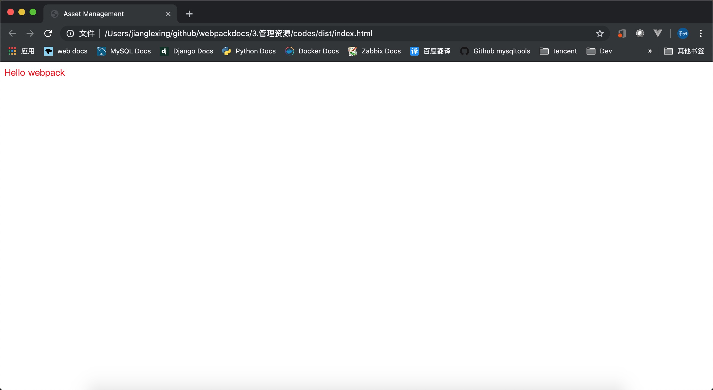
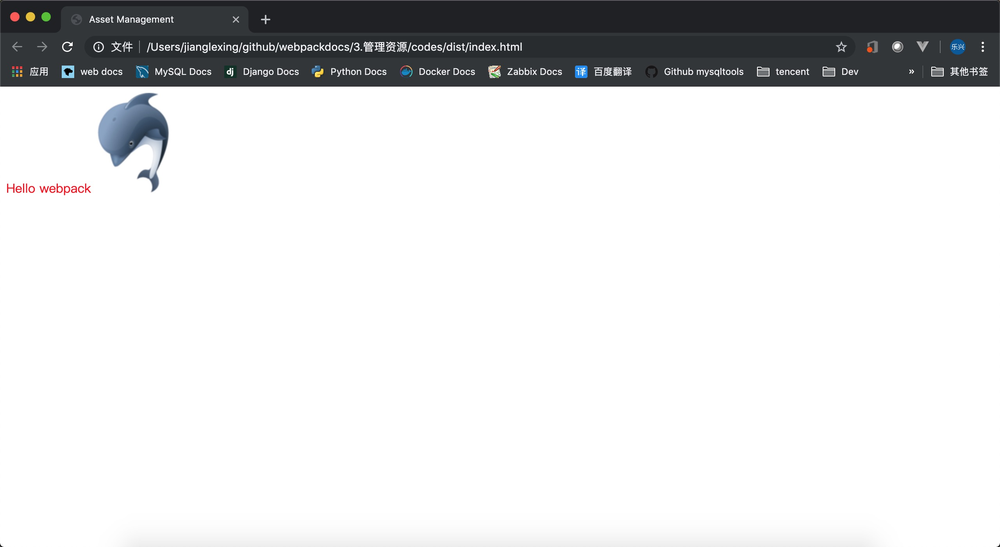
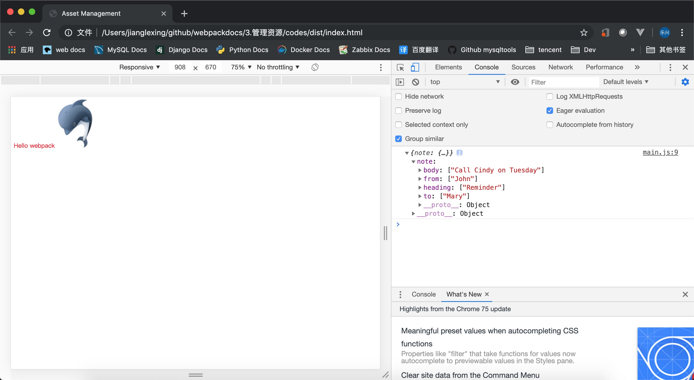

## 目录

- [管理资源](#管理资源)
- [加载CSS](#加载CSS)
- [加载数据](#加载数据)

---


## 管理资源
   **如果你是从开始一直遵循着指南的示例，现在会有一个小项目，显示 "Hello webpack"。现在我们尝试整合一些其他资源，比如图像，看看 webpack 如何处理。**

   **webpack 最出色的功能之一就是，除了 JavaScript，还可以通过 loader 引入任何其他类型的文件。也就是说，以上列出的那些 JavaScript 的优点（例如显式依赖），同样可以用来构建网站或 web 应用程序中的所有非 JavaScript 内容。让我们从 CSS 开始起步，或许你可能已经熟悉了这个设置过程。**

   ---

## 加载CSS
   **1、** 安装相关的 loader 
   ```bash
   npm install --save-dev style-loader css-loader
   ```

   **2、** 在 module 中增加 style-loader 和 css-loader
   ```js
   const path = require('path');
   
   module.exports = {
       entry: './src/index.js',
       output:{
           filename: 'main.js',
           path:path.resolve(__dirname,'dist')
       },
       module: {
           rules:[
               {
                   test:/\.css$/,
                   use: ['style-loader','css-loader']
               }
           ]
       }
   };
   ```
   >webpack 根据正则表达式，来确定应该查找哪些文件，并将其提供给指定的 loader。在这种情况下，以 .css 结尾的全部文件，都将被提供给 style-loader 和 css-loader。

   **3、** 增加 css 文件
   ```bash
   touch src/style.css
   ```
   src/style.css 内容如下
   ```css
   .hello {
     color: red;
   }
   ```

   **4、** 打包
   ```bash
   npx webpack
   Hash: 12e651cc7e99f6b05014
   Version: webpack 4.35.3
   Time: 2901ms
   Built at: 2019-07-09 10:24:51
     Asset      Size  Chunks             Chunk Names
   main.js  76.3 KiB       0  [emitted]  main
   Entrypoint main = main.js
   [1] ./src/index.js 326 bytes {0} [built]
   [2] (webpack)/buildin/global.js 472 bytes {0} [built]
   [3] (webpack)/buildin/module.js 497 bytes {0} [built]
   [4] ./src/style.css 1.06 KiB {0} [built]
   [5] ./node_modules/css-loader/dist/cjs.js!./src/style.css 168 bytes {0} [built]
       + 4 hidden modules
   
   WARNING in configuration
   The 'mode' option has not been set, webpack will fallback to 'production' for this value. Set 'mode'    option to 'development' or 'production' to enable defaults for each environment.
   You can also set it to 'none' to disable any default behavior. Learn more: https://webpack.js.org/   configuration/mode/
   ```
   

   ---

## 加载图片
   **对于要使用图片的场景 webpack 使用 file-loader 解决**
   
   **1、** 安装 file-loader 
   ```bash
   npm install --save-dev file-loader
   ```
   **2、** 增加配置
   ```js
   const path = require('path');
   
   module.exports = {
       entry: './src/index.js',
       output:{
           filename: 'main.js',
           path:path.resolve(__dirname,'dist')
       },
       module: {
           rules:[
               {
                   test:/\.css$/,
                   use: ['style-loader','css-loader']
               },
               {
                   test:/\.(png|jpg|svg|gif)$/,
                   use:'file-loader'
               }
           ]
       }
   };
   ```
   **3、** 在 src/index.js 中使用图片
   ```js
   import _ from 'lodash';
   import './style.css';
   import icon from './favicon.ico';
   
     function component() {
       var element = document.createElement('div');
   
       // lodash 是由当前 script 脚本 import 导入进来的
       element.innerHTML = _.join(['Hello', 'webpack'], ' ');
       element.classList.add('hello');
   
       var myIcon = new Image();
       myIcon.src = icon;
       element.appendChild(myIcon);
   
       return element;
     }
   
     document.body.appendChild(component());
   ```
   **4、** 生成
   ```sql
   npx webpack
   Hash: 2bc878a88d91e645b391
   Version: webpack 4.35.3
   Time: 2811ms
   Built at: 2019-07-09 13:34:36
                                  Asset      Size  Chunks             Chunk Names
   d3c17b34640b3cb9fd0eec15b9972b81.ico  66.1 KiB          [emitted]  
                                main.js  76.5 KiB       0  [emitted]  main
   Entrypoint main = main.js
   [1] ./src/favicon.ico 82 bytes {0} [built]
   [2] ./src/index.js 447 bytes {0} [built]
   [3] (webpack)/buildin/global.js 472 bytes {0} [built]
   [4] (webpack)/buildin/module.js 497 bytes {0} [built]
   [5] ./src/style.css 1.06 KiB {0} [built]
   [6] ./node_modules/css-loader/dist/cjs.js!./src/style.css 168 bytes {0} [built]
       + 4 hidden modules
   
   WARNING in configuration
   The 'mode' option has not been set, webpack will fallback to 'production' for this value. Set 'mode'    option to 'development' or 'production' to enable defaults for each environment.
   You can also set it to 'none' to disable any default behavior. Learn more: https://webpack.js.org/   configuration/mode/
   ```
   

   ---

## 加载数据
   **除了可以加载 css 文件之外，有时候我们可能还要加载其它数据文件如 json xml csv ，默认 node 是支持 json 的，但是其它的文件就要使用 loader了**

   **1、** 安装用于 xml 和 csv 的 loader
   ```bash
   npm install --save-dev csv-loader xml-loader
   ```
   **2、** 配置 loader
   ```js
   const path = require('path');
   
   module.exports = {
       entry: './src/index.js',
       output:{
           filename: 'main.js',
           path:path.resolve(__dirname,'dist')
       },
       module: {
           rules:[
               {
                   test:/\.css$/,
                   use: ['style-loader','css-loader']
               },
               {
                   test:/\.(png|jpg|svg|gif|ico)$/,
                   use:'file-loader'
               },
               {
                   test:/\.csv$/,
                   use:'csv-loader'
               },
               {
                   test:/\.xml$/,
                   use:'xml-loader'
               }
           ]
       }
   };
   ```
   **3、** 打包
   ```bash
   npx webpack
   Hash: 10b9c77aae1c193f93eb
   Version: webpack 4.35.3
   Time: 2934ms
   Built at: 2019-07-09 17:08:01
                                  Asset      Size  Chunks             Chunk Names
   d3c17b34640b3cb9fd0eec15b9972b81.ico  66.1 KiB          [emitted]  
                                main.js  76.6 KiB       0  [emitted]  main
   Entrypoint main = main.js
   [1] ./src/favicon.ico 82 bytes {0} [built]
   [2] ./src/data.xml 113 bytes {0} [built]
   [3] ./src/index.js 500 bytes {0} [built]
   [4] (webpack)/buildin/global.js 472 bytes {0} [built]
   [5] (webpack)/buildin/module.js 497 bytes {0} [built]
   [6] ./src/style.css 1.06 KiB {0} [built]
   [7] ./node_modules/css-loader/dist/cjs.js!./src/style.css 168 bytes {0} [built]
       + 4 hidden modules
   
   WARNING in configuration
   The 'mode' option has not been set, webpack will fallback to 'production' for this value. Set 'mode'    option to 'development' or 'production' to enable defaults for each environment.
   You can also set it to 'none' to disable any default behavior. Learn more: https://webpack.js.org/   configuration/mode/
   ```
   

   ---

