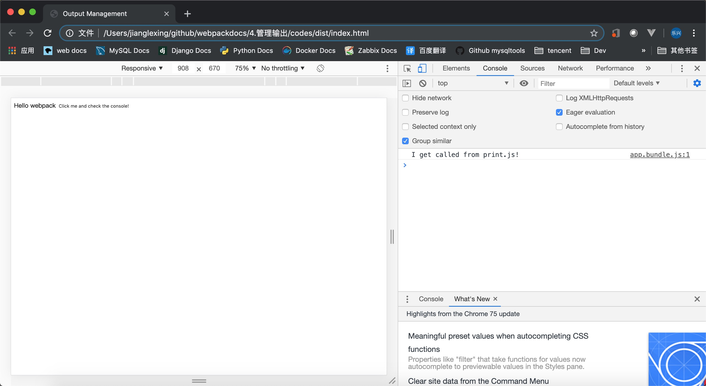

## 目录
- [管理输出](#管理输出)
- [准备项目](#准备项目)
- [存在的问题](#存在的问题)
- [设定HtmlWebpackPlugin](#设定HtmlWebpackPlugin)
- [清理dist文件夹](#清理dist文件夹)
---


## 管理输出
   **到目前为止，我们在 index.html 文件中手动引入所有资源，然而随着应用程序增长，并且一旦开始对文件名使用哈希(hash)]并输出多个 bundle，手动地对 index.html 文件进行管理，一切就会变得困难起来。然而，可以通过一些插件，会使这个过程更容易操控。**

   ---

## 准备项目
   **1、** 创建项目并增加两个 js 文件
   ```
   ll
   total 296
   drwxr-xr-x  334 jianglexing  staff   10688  7 10 10:27 node_modules
   -rw-r--r--    1 jianglexing  staff  147179  7 10 10:27 package-lock.json
   -rw-r--r--    1 jianglexing  staff     398  7 10 10:27 package.json
   drwxr-xr-x    4 jianglexing  staff     128  7 10 10:28 src

   ll src/
   total 0
   -rw-r--r--  1 jianglexing  staff  0  7 10 10:27 index.js
   -rw-r--r--  1 jianglexing  staff  0  7 10 10:28 print.js
   ```
   **2、** src/print.js
   ```js
   export default function printMe() {
     console.log('I get called from print.js!');
   }
   ```
   **3、** src/index.js
   ```js
   import _ from 'lodash';
   import printMe from './print.js';
   
     function component() {
       var element = document.createElement('div');
      var btn = document.createElement('button');
   
       element.innerHTML = _.join(['Hello', 'webpack'], ' ');
   
      btn.innerHTML = 'Click me and check the console!';
      btn.onclick = printMe;
   
      element.appendChild(btn);
   
       return element;
     }
   
   document.body.appendChild(component());
   ```
   **4、** dist/index.html
   ```html
   <!doctype html>
   <html>
     <head>
        <title>Output Management</title>
        <script src="./print.bundle.js"></script>
     </head>
     <body>
        <script src="./app.bundle.js"></script>
     </body>
   </html>
   ```
   **5、** webpack.config.js
   ```js
  const path = require('path');

  module.exports = {

   entry: {
     app: './src/index.js',
     print: './src/print.js'
   },
    output: {
     filename: '[name].bundle.js',
      path: path.resolve(__dirname, 'dist')
    }
  };
   ```
   **6、** 生成
   ```bash
   npx webpack
   Hash: b95bc84771f0628ead54
   Version: webpack 4.35.3
   Time: 2714ms
   Built at: 2019-07-10 10:39:49
             Asset      Size  Chunks             Chunk Names
     app.bundle.js  70.7 KiB    0, 1  [emitted]  app
   print.bundle.js  1.02 KiB       1  [emitted]  print
   Entrypoint app = app.bundle.js
   Entrypoint print = print.bundle.js
   [0] ./src/print.js 87 bytes {0} {1} [built]
   [2] ./src/index.js 418 bytes {0} [built]
   [3] (webpack)/buildin/global.js 472 bytes {0} [built]
   [4] (webpack)/buildin/module.js 497 bytes {0} [built]
       + 1 hidden module
   
   WARNING in configuration
   The 'mode' option has not been set, webpack will fallback to 'production' for this value. Set 'mode' option to 'development' or 'production' to enable defaults for each environment.
   You can also set it to 'none' to disable any default behavior. Learn more: https://webpack.js.org/configuration/mode/
   ```
   **7、** 查看效果
   

   ---

## 存在的问题
   **但是，如果我们更改了我们的一个入口起点的名称，甚至添加了一个新的名称，会发生什么？生成的包将被重命名在一个构建中，但是我们的index.html文件仍然会引用旧的名字。最好它能自动解决，事实上 html-webpack-plugin就是用来做这个事的**

   ---

## 设定HtmlWebpackPlugin
   **1、** 安装 html-webpack-plugin
   ```bash
   npm install --save lodash
   
   
   npm WARN csv-loader@3.0.2 requires a peer of papaparse@^4.5.0 but none is installed. You must install    peer dependencies yourself.
   npm WARN codes@1.0.0 No description
   npm WARN codes@1.0.0 No repository field.
   
   + lodash@4.17.13
   added 1 package from 2 contributors and audited 5444 packages in 2.908s
   found 0 vulnerabilities
   ```

   **2、** 配置 webpack.config.js
   ```js
   const path = require('path');
   const HtmlWebpackPlugin = require('html-webpack-plugin');
   
   module.exports = {
   
   entry: {
       app: './src/index.js',
       print: './src/print.js'
   },
   output: {
       filename: '[name].bundle.js',
       path: path.resolve(__dirname, 'dist')
    },
   plugins: [
       new HtmlWebpackPlugin({
          title: 'Output Management'
       })
      ]
      
   };
   ```

   **3、** 生成
   ```bash
   npx webpack
   Hash: 1310cc774a20622efe67
   Version: webpack 4.35.3
   Time: 590ms
   Built at: 2019-07-10 14:28:06
             Asset       Size  Chunks             Chunk Names
     app.bundle.js   70.7 KiB    0, 1  [emitted]  app
        index.html  254 bytes          [emitted]  
   print.bundle.js   1.02 KiB       1  [emitted]  print
   Entrypoint app = app.bundle.js
   Entrypoint print = print.bundle.js
   [0] ./src/print.js 87 bytes {0} {1} [built]
   [2] ./src/index.js 418 bytes {0} [built]
   [3] (webpack)/buildin/global.js 472 bytes {0} [built]
   [4] (webpack)/buildin/module.js 497 bytes {0} [built]
       + 1 hidden module
   
   WARNING in configuration
   The 'mode' option has not been set, webpack will fallback to 'production' for this value. Set 'mode'    option to 'development' or 'production' to enable defaults for each environment.
   You can also set it to 'none' to disable any default behavior. Learn more: https://webpack.js.org/   configuration/mode/
   Child html-webpack-plugin for "index.html":
        1 asset
       Entrypoint undefined = index.html
       [2] (webpack)/buildin/global.js 472 bytes {0} [built]
       [3] (webpack)/buildin/module.js 497 bytes {0} [built]
           + 2 hidden modules
   ```
   **4、** 自动生成的 dist/index.html 内容如下
   ```html
   <!DOCTYPE html>
   <html>
     <head>
       <meta charset="UTF-8">
       <title>Output Management</title>
     </head>
     <body>
     <script type="text/javascript" src="app.bundle.js"></script><script type="text/javascript" src="print.bundle.js"></script></body>
   </html>
   ```
   ---


## 清理dist文件夹
   **1、** 安装插件
   ```bash
   npm install clean-webpack-plugin --save-dev
   ```
   **2、** 配置 webpack 
   ```js
   const path = require('path');
   const HtmlWebpackPlugin = require('html-webpack-plugin');
   const {CleanWebpackPlugin} = require('clean-webpack-plugin');
   
   module.exports = {
   
   entry: {
       app: './src/index.js',
       print: './src/print.js'
   },
   output: {
       filename: '[name].bundle.js',
       path: path.resolve(__dirname, 'dist')
    },
   plugins: [
       new HtmlWebpackPlugin({
          title: 'Output Management'
       }),
       new CleanWebpackPlugin()
      ]
   
   };
   ```