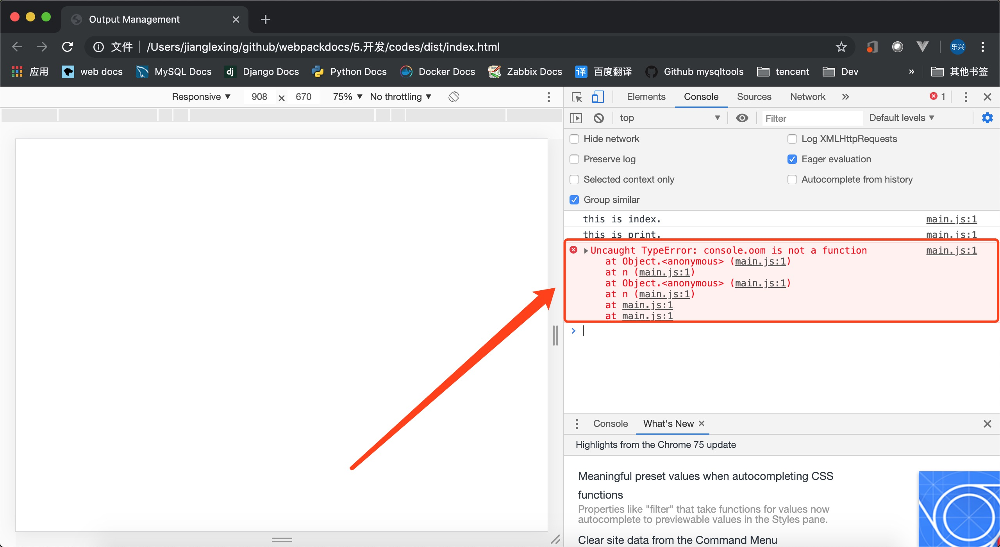
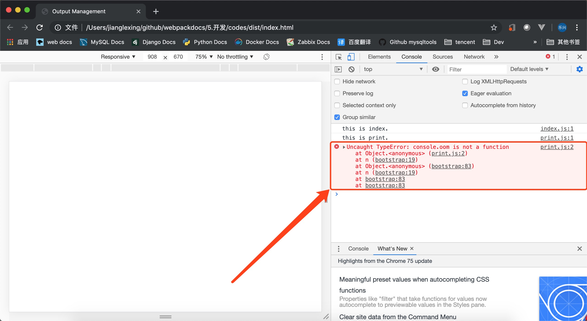

## 目录
- [开发](#开发)
- [入口文件](#入口文件)
- [webpack配置文件](#webpack配置文件)
- [index.html文件](#index.html文件)
- [配置sourcemap](#配置sourcemap)
- [使用webpack-dev-server](#使用webpack-dev-server)
---

## 开发
   **如果你一直跟随之前的指南，应该对一些 webpack 基础知识有着很扎实的理解。在我们继续之前，先来看看如何建立一个开发环境，使我们的开发变得更容易一些。**

   ---

## 入口文件
   **1、** src/index.js
   ```js
   console.log("this is index.");
   ```
   **2、** src/print.js
   ```js
   console.log("this is print.");
   console.oom("this is a error"); // 这个是故意这样写的 由于 console 对象没有 oom 方法所以运行时会报错
   ```
   ---

## webpack配置文件
   ```js
   const path = require('path');
   const HtmlWebpackPlugin = require('html-webpack-plugin');
   const {CleanWebpackPlugin} = require('clean-webpack-plugin');
   
   module.exports = {
   
   entry: ['./src/index.js','./src/print.js'
   ],
   output: {
       filename: 'main.js',
       path: path.resolve(__dirname, 'dist')
    },
   plugins: [
       new HtmlWebpackPlugin({
          title: 'Output Management'
       }),
       new CleanWebpackPlugin()
      ],
   //devtool:'inline-source-map'
   
   };
   ```

   ---

## index.html文件
   ```html
   <!DOCTYPE html>
   <html>
     <head>
       <meta charset="UTF-8">
       <title>Output Management</title>
     </head>
     <body>
     <script type="text/javascript" src="main.js"></script></body>
   </html>
   ```
   

   由上面的图可以看到我们并不能直接看到错误所在的文件，这样的话对我们的 debug 就造成了影响。

   ---


## 配置sourcemap
   **通过 devtool 配置项来完成**
   ```js
   const path = require('path');
   const HtmlWebpackPlugin = require('html-webpack-plugin');
   const {CleanWebpackPlugin} = require('clean-webpack-plugin');
   
   module.exports = {
   
   entry: ['./src/index.js','./src/print.js'
   ],
   output: {
       filename: 'main.js',
       path: path.resolve(__dirname, 'dist')
    },
   plugins: [
       new HtmlWebpackPlugin({
          title: 'Output Management'
       }),
       new CleanWebpackPlugin()
      ],
   devtool:'inline-source-map'
   
   };
   ```
   

   ---

## 使用webpack-dev-server
   **webpack-dev-server 为你提供了一个简单的 web 服务器，并且能够实时重新加载(live reloading)**

   **1、** 安装 webpack-dev-server 插件
   ```
   npm install --save-dev webpack-dev-server
   ```
   **2、** 启动 web pack 服务
   ```js
   webpack-dev-server
   ℹ ｢wds｣: Project is running at http://localhost:8080/
   ℹ ｢wds｣: webpack output is served from /
   ℹ ｢wds｣: Content not from webpack is served from ./dist
   ℹ ｢wdm｣: Hash: ddb61a04d6d07eb1d844
   Version: webpack 4.35.3
   Time: 737ms
   Built at: 2019-07-14 10:00:52
        Asset       Size  Chunks             Chunk Names
   index.html  186 bytes          [emitted]  
      main.js    873 KiB    main  [emitted]  main
   Entrypoint main = main.js
   ```

   ---

## 配置webpack-dev-server到npm脚本
   ```js
   {
     "name": "codes",
     "version": "1.0.0",
     "description": "",
     "main": "index.js",
     "scripts": {
       "test": "echo \"Error: no test specified\" && exit 1",
       "start": "webpack-dev-server"
     },
     "keywords": [],
     "author": "",
     "license": "ISC",
     "devDependencies": {
       "clean-webpack-plugin": "^3.0.0",
       "html-webpack-plugin": "^3.2.0",
       "webpack": "^4.35.3",
       "webpack-cli": "^3.3.5",
       "webpack-dev-server": "^3.7.2"
     }
   }
   ```

   ---
